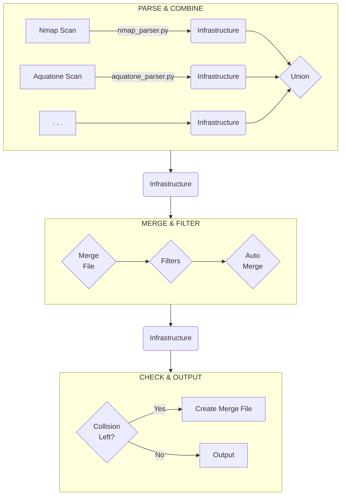

# Internals

This document describes the internals of scans2any.

## Structure



### *PARSE & COMBINE*

Input files are parsed using their respective parser, resulting in an
`Infrastructure` object for each file. These infrastructure objects are then
unioned, meaning they are combined without any merging or data loss. This
results in one single combined `Infrastructure`.

### *MERGE & FILTER*

In this step, collisions in the combined infrastructure are tried to resolve and
filters are applied that further compress the information, e.g., filtering certain
blacklisted IPs or filter banner information from Nmap scans.

By collisions, we mean multiple detected service names or banners for the same
port. Collisions are resolved using the following steps (increasing in
priority):

1. application-internal auto-merge rules (e.g., resolve `https`+`www` to `https`)
2. user-defined auto-merge rules (in merge-file)
3. user-defined manual merge rules (in merge-file)

This ordering is flipped in the chart because higher priority rules, have to be
applied first in the code. (Resolved conflicts will not be resolved again)

### *CHECK & OUTPUT*

If there are still any unresolved collisions at this point, a merge-file,
listing the collisions, is created and the user is prompted to resolve them
manually (and run again afterward, providing the merge-file to the program).

Otherwise, the output is generated in the chosen output format.

### Infrastructure Objects

Internally used objects to represent infrastructure.

#### Service

```txt
Internal representation of a service run by a host.

Attributes
----------
port : int
    Numerical port of the service
protocol: str
    tcp/udp
service_names: SortedSet[str]
    Service names, e.g. `http`, `ssh`. A SortedSet of service names, containing
    multiple entries when there have been service name collisions.
banners: SortedSet[str]
    Additional information about the service, e.g. `Apache httpd x.y`
```

#### Host

```txt
Internal representation of an IPv4 host and corresponding information.

Attributes
----------
address : str | None
    IPv4 Address
hostnames : SortedSet[str]
    List of corresponding hostnames
services : list[Service]
    A list of available services
os : SortedSet[tuple]
    Operating system, if available
```

#### Infrastructure

```txt
Internal representation of parsed infrastructure scans.

No two hosts with the same ip address possible.

Attributes
----------
_hosts : list[Host]
    List of scanned and available hosts
identifier : str
    Additional information, like `Nmap scan infrastructure`
```

### Merge

Duplicate hosts have to be identified. Their information can complement each
other, but also has to be compared for conflicts. These conflicts have to be
solved interactively by the user using a `merge-file`.

Out-of-scope hosts should also be removed from the results in this step.
